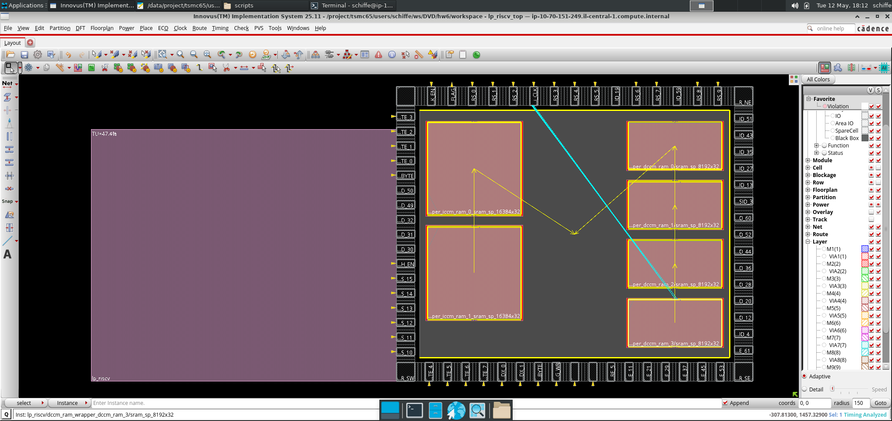
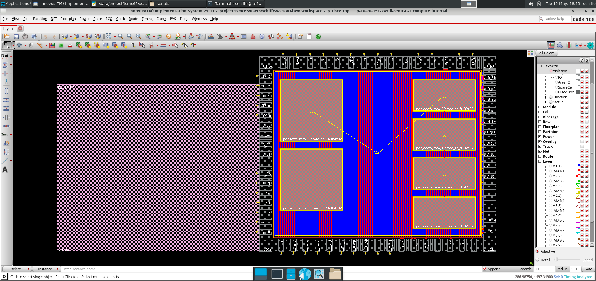
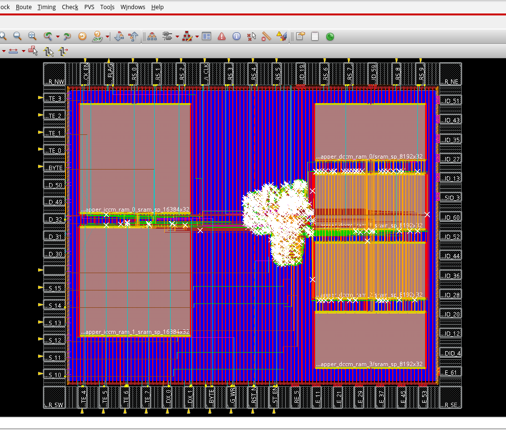
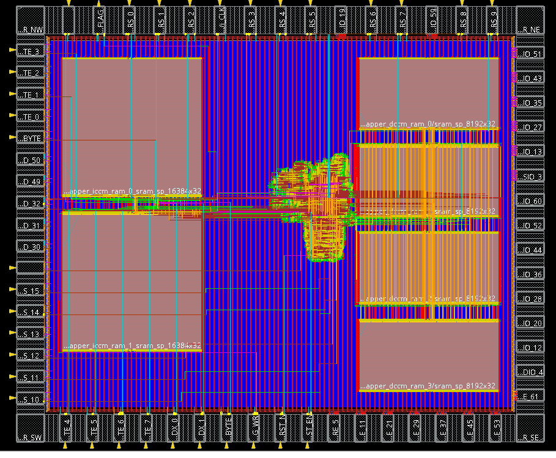
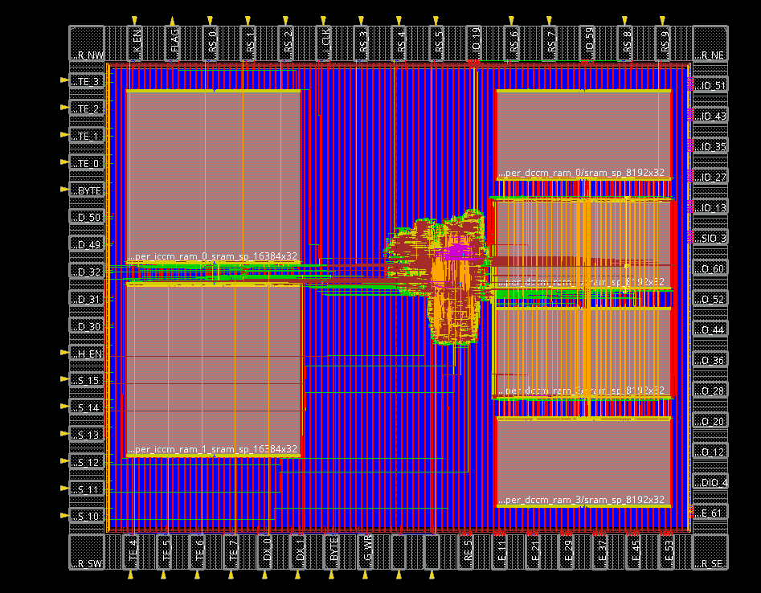
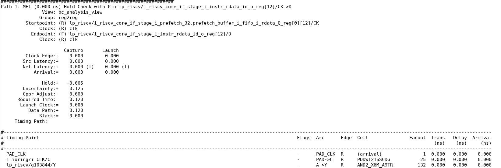
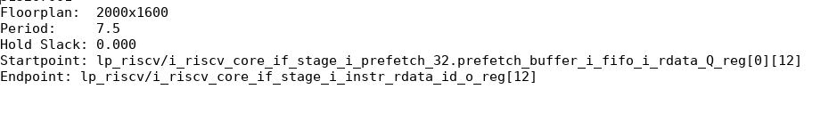

# RISC-V SoC Physical Design (RTL2GDS)

This repository documents the complete Physical Design (PnR) flow of a Low-Power RISC-V SoC core, implemented using **Cadence Innovus** in **TSMC 65nm** technology. The project covers the full cycle from synthesized gate-level netlist to a production-ready GDSII layout.

## 🛠️ Design Flow & Milestones

The following sections illustrate the physical implementation process, showcasing the evolution from a blank floorplan to a fully routed and optimized silicon layout.

### 1. Floorplanning & Macro Placement
The process began with defining the die area and strategically placing the hard macros (SRAM blocks). A relative floorplan approach was used to optimize area and ensure efficient communication between the memory units and the core logic.

### 2. Power Planning (VDD/GND Railways)
Implementation of the robust Power Distribution Network (PDN). This included creating core rings and vertical/horizontal power stripes (M2-M5) to ensure stable voltage supply across the chip and minimize IR drop.

### 3. Standard Cell Placement
Automated placement of thousands of standard cells. This stage involved congestion analysis and initial timing-driven placement to minimize wirelength and meet performance targets.

### 4. Clock Tree Synthesis (CTS)
Building the clock distribution network. Using **CCopt**, a balanced clock tree was synthesized to minimize skew and insertion delay, ensuring synchronized operation across all flip-flops in the design.

### 5. Detailed Routing
The final interconnect stage where all logical nets are physically routed using multiple metal layers. The routing was timing and SI (Signal Integrity) driven to prevent crosstalk and meet setup/hold requirements.

## 📊 Signoff & Results

The design underwent rigorous signoff checks to ensure manufacturing readiness.

### Timing Closure
Successful timing closure was achieved at the post-route stage. The final reports show a positive slack for both Setup and Hold, ensuring the design operates reliably at the target frequency.

### Physical Verification & Statistics
The final layout passed all physical verification checks with **Zero DRC and Connectivity violations**. The block statistics confirm efficient resource utilization and density.

---
**Key Results Summary:**
- **Technology:** TSMC 65nm
- **Tools:** Cadence Innovus (Common UI)
- **Physical Violations:** 0 (DRC/LVS Clean)
- **Timing Status:** Fully Closed (Setup & Hold)
